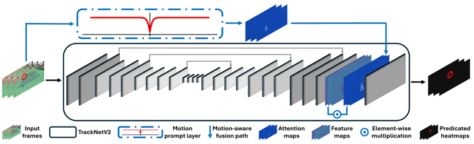
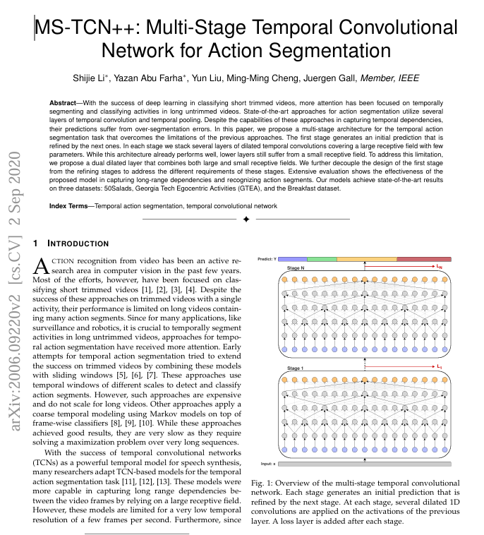
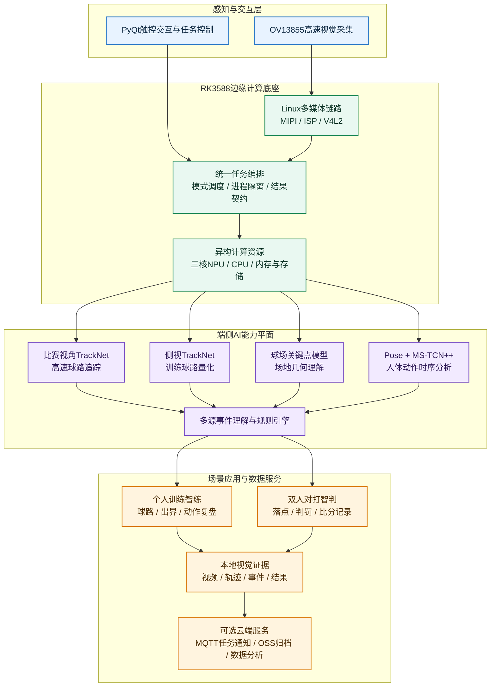

<div align="center">

# 球悟AI

### 基于RK3588的网球智练智判系统

双视角时序追踪 · 多模型端侧协同 · 人体动作理解 · 辅助判罚 · 端云闭环


</div>

## 评审入口

- [作品演示视频](submission/嵌赛视频.mp4)
- [项目技术文档](submission/技术文档-球悟AI.pdf)
- [开放范围与知识产权边界](OPEN_SOURCE_SCOPE.md)

## 项目概述

球悟AI面向网球个人训练、教练辅助和双人对打场景，以RK3588高性能边缘计算平台为核心，构建“视觉采集—多模型理解—事件分析—训练/判罚—本地可视化—云端服务”的完整产品链路。

系统针对机位、目标尺度和业务目标不同的两类场景建立专用能力：个人训练模式从侧视视角量化球路与人体动作，支持训练回放和动作复盘；双人对打模式从比赛视角完成高速网球追踪、球场定位、落地事件理解、界内外辅助判罚和比分记录。两种模式均可在无网络环境下形成端侧闭环，并可按需将视频和结构化结果接入云端长期服务。

项目完成比赛视角TrackNet、侧视TrackNet、球场关键点检测和MS-TCN++动作时序识别等模型向RK3588的部署适配，并以MediaPipe Pose、事件理解与规则引擎组成配套分析链。模型能力按场景调度，避免将不同视角强行交给单一模型处理，兼顾实时性、稳定性与结果可解释性。

## 核心能力

| 能力 | 端侧作用 | 产品结果 |
|---|---|---|
| 双视角高速网球追踪 | 分别适配比赛机位与侧视训练机位，恢复逐帧网球位置和连续球路 | 轨迹回放、落点证据、球路量化 |
| 球场几何理解 | 识别标准球场关键位置并建立画面与场地之间的几何关系 | 场区定位、界内外判断、Mini-court映射 |
| 人体动作时序分析 | 从人体骨架序列理解发球、正手、反手等连续动作片段 | 动作标签、训练片段和可视化复盘 |
| 比赛事件与规则引擎 | 融合球路、球场和运动员上下文形成可解释事件 | 落地记录、辅助判罚、比分与争议球复核 |
| 端云数据闭环 | 端侧离线处理，联网后归档视频与结构化结果 | 历史任务、量化统计和长期用户服务 |

## 模型与算法体系

### TrackNet时序热图追踪

TrackNet面向高速、小目标和运动模糊场景，不依赖单帧检测框，而是联合连续画面的时序信息学习网球运动特征，并输出位置热图。系统从热图恢复逐帧球心，再结合连续性分析形成可回放的完整球路。

项目分别构建比赛视角与侧视训练视角的TrackNet能力：前者服务固定比赛机位下的落点与判罚，后者适配个人训练中的近距离球路和出界统计。两套模型共享端侧运行框架，但保留独立的数据分布和场景适配，提升多场景稳定性。



> TrackNet时序热图与运动注意力增强架构示意，用于说明连续画面、运动提示、特征融合和位置热图之间的关系。

### MediaPipe Pose与MS-TCN++

人体动作链采用“空间姿态感知+时间序列理解”的两级结构。MediaPipe Pose逐帧提取人体骨架，形成连续姿态序列；MS-TCN++通过多阶段时间卷积建模动作前后依赖，对长视频进行逐帧动作分割与类别识别。相比仅识别单张姿态，该结构能够理解动作的持续过程和阶段变化，用于输出发球、正手、反手等动作片段及训练时间线。



> MS-TCN++论文与多阶段时序卷积结构示意，用于说明动作序列经过多阶段细化后形成逐帧动作分割结果的基本原理。

### 球场关键点与几何映射

球场模型从比赛画面中定位具有明确语义的场地关键位置，并建立图像坐标与标准网球场坐标之间的映射。系统在获得可信场地结果后锁定并复用几何关系，使后续轨迹能够转换为具有规则含义的场区位置，为Mini-court、界内外判断和落点复核提供统一坐标基础。

### 多源事件理解与辅助判罚

系统不把单一坐标突变直接视作比赛结论，而是联合球路时序、球场几何、运动员上下文和回合状态形成事件证据，再由规则引擎输出落地、场区、得分与判罚原因。视频标记、轨迹记录、事件记录和判罚摘要共同构成可复核的视觉证据链。

## RK3588端侧智能架构



架构以统一任务编排为中枢，将摄像头与多媒体链路、NPU模型运行、CPU事件分析、本地结果和云端服务解耦。四个RKNN模型按业务模式调度，TrackNet并行任务可由独立Runtime绑定NPU核心执行；CPU侧负责视频链路、上下文分析和产品逻辑，形成NPU、CPU与多媒体硬件协同工作的端侧系统。

## 公开性能摘要

以下为项目技术文档所采用测试环境中的统一TrackNet板端基准，指标用于说明RK3588适配效果，不代表所有输入视频和完整业务链均保持相同帧率。

| 指标 | 实测结果 |
|---|---:|
| 三核TrackNet推理阶段总吞吐 | 57.75FPS |
| 单实例NPU推理平均耗时 | 40.86ms/frame |
| 前处理平均耗时 | 10.56ms/frame |
| 后处理平均耗时 | 0.49ms/frame |
| NPU三核利用率采样 | Core0 82% / Core1 82% / Core2 83% |

## 分层开放与知识产权边界

企业赛题建议参赛项目开放源码。球悟AI采用“产品框架开源、核心运行时受控”的分层开放方式：公开足以审阅系统工程结构、摄像头与界面集成、端侧任务组织、结果接口和云端协同；将自研模型资产、数据体系、生产参数和可直接复现核心能力的实现保留在设备侧私有运行时中。

| 层级 | 对外状态 | 主要内容 |
|---|---|---|
| 产品工程与主体框架 | 已开源 | 统一入口、PyQt界面、OV13855/V4L2接入、比赛与训练Pipeline、三核运行计划、模型组件接口、结果展示、运行时桥接、MQTT/OSS通用适配 |
| 架构与能力说明 | 已公开 | 四模型协同关系、双模式业务流程、RK3588异构计算架构、输入输出结果和公开性能指标 |
| 核心AI运行时 | 不公开 | 模型权重、训练与标定数据、模型转换参数、模型前后处理、轨迹与事件分析、球场映射和判罚实现 |
| 生产与硬件资产 | 不公开 | 三核调优参数、摄像头驱动与ISP适配、生产云配置、设备身份、结构与工业设计源文件 |

这种边界不会隐藏系统架构和作品完成度：组委会和企业可通过公开源码、技术文档、演示视频、稳定接口和实机运行结果审阅完整链路；同时，公开仓库不会直接形成核心模型与商业运行时的复制品。完整说明见[OPEN_SOURCE_SCOPE.md](OPEN_SOURCE_SCOPE.md)。

## 公开工程快速使用

公开仓库可直接运行环境检查、触控界面和摄像头功能：

```bash
python3 qiuwu.py check
python3 qiuwu.py
python3 qiuwu.py camera --device /dev/video11 --width 1920 --height 1080 --fps 60
```

完整设备交付包通过私有运行时清单接入AI能力：

```bash
cp runtime.private.example.json runtime.private.json
python3 qiuwu.py run --mode match --video match_judgement/input.mp4
python3 qiuwu.py run --mode side --video side_training/input.mp4
```

`runtime.private.json`、模型文件、数据、输入视频、结果文件和生产云配置均已加入Git忽略规则。

## 工程结构

```text
.
├── qiuwu.py                     # 产品统一入口
├── runtime_bridge.py            # 公开产品层与私有AI运行时的稳定接口
├── runtime.private.example.json # 私有运行时接入模板
├── edge_runtime/                # 跨模型契约、组件API与三核NPU运行计划
├── contracts/                   # 面向外部服务的标准化结果Schema
├── models/                      # 四模型公开角色与私有资产占位说明
├── camera_recorder.py           # OV13855/V4L2通用预览与录制
├── gui/                         # PyQt触控界面、任务控制与结果展示
├── match_judgement/             # 双人对打主体Pipeline与云端适配
├── side_training/               # 个人训练主体Pipeline
├── submission/                  # 公开演示与技术文档
└── OPEN_SOURCE_SCOPE.md         # 开放范围、保留内容与贡献边界
```

## 许可说明

仓库中的程序源代码按`AGPL-3.0-only`许可发布。名称“球悟AI”、标识、演示视频、技术文档、模型、数据、私有运行时、设备参数及未在仓库中明确发布的技术成果不属于该源代码许可范围。详见[NOTICE.md](NOTICE.md)。

公开代码允许研究、审阅和在许可证约束下复用；商业部署、完整AI运行时、模型授权和品牌使用需另行取得许可。
