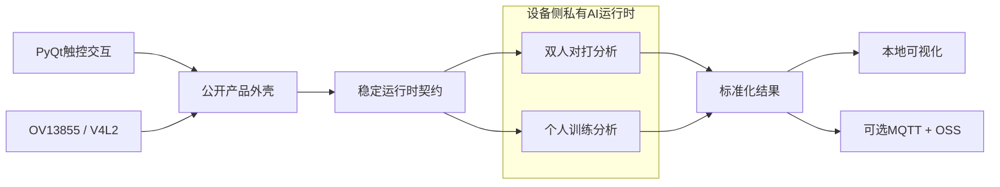

<div align="center">

# 球悟AI

### 基于RK3588的网球智练智判系统

端侧多模型协同 · OV13855实时采集 · PyQt触控交互 · 三核NPU运行架构 · 端云数据闭环


</div>

## 评审材料

- [作品演示视频](submission/嵌赛视频.mp4)
- [项目技术文档](submission/技术文档-球悟AI.pdf)

## 项目简介

球悟AI面向网球个人训练、教练辅助和双人对打场景，以RK3588为端侧计算核心，形成摄像头采集、触控交互、任务调度、结果可视化和可选云端归档的一体化工程。系统设有个人训练与双人对打两种模式，完整产品版本能够组织球路追踪、人体动作分析、球场定位、比赛事件分析和辅助判罚等能力，并在断网环境下完成端侧闭环。

本仓库是面向技术交流和工程复用的公开版本。我们开放产品外围工程、标准接口和通用适配层；模型资产、训练数据、AI运行时和业务核心算法由独立私有组件提供，不在公开仓库中发布。这样既便于评审理解完整产品架构，也避免将数据、参数和核心实现混入公共代码。

## 开放内容

| 模块 | 公开内容 |
|---|---|
| 统一入口 | GUI、摄像头、任务检查和运行模式的单入口调度 |
| 触控界面 | PyQt模式选择、任务状态、视频回放、比分与事件展示 |
| 摄像头接入 | OV13855/V4L2通用预览、录制和设备参数接口 |
| 任务编排 | 子进程生命周期、日志回传、结果文件监视与解析 |
| 端云适配 | Unix Domain Socket、MQTT通知、OSS文件归档的通用适配层 |
| 运行时契约 | 比赛模式、训练模式及结果文件的稳定接入规范 |

以下内容不随公开仓库发布：模型权重与中间模型、训练与标定数据、模型转换和量化参数、模型输入输出适配、轨迹与事件算法、球场映射、落地/击球区分、判罚计分策略、三核调度参数、摄像头固件与驱动补丁、生产云配置以及外观结构源文件。完整边界见[开放范围说明](OPEN_SOURCE_SCOPE.md)。

## 系统架构



完整部署中的AI运行时按场景调度比赛视角追踪、侧视追踪、球场关键点与动作时序识别等模型。公开工程只依赖运行时契约，不依赖这些模型的内部网络、参数或后处理实现。

## 快速使用

公开功能可直接启动：

```bash
python3 qiuwu.py check
python3 qiuwu.py
python3 qiuwu.py camera --device /dev/video11 --width 1920 --height 1080 --fps 60
```

接入内部部署包时，将示例清单复制为本地私有清单并填写运行器路径：

```bash
cp runtime.private.example.json runtime.private.json
python3 qiuwu.py run --mode match --video match_judgement/input.mp4
python3 qiuwu.py run --mode side --video side_training/input.mp4
```

`runtime.private.json`、模型文件、输入视频、结果文件和生产云配置均已加入忽略规则，不应提交到公共仓库。

## 工程结构

```text
.
├── qiuwu.py                    # 产品统一入口
├── runtime_bridge.py           # 公开外壳与私有运行时之间的命令契约
├── runtime.private.example.json# 私有运行时接入示例
├── contracts/                  # 标准化任务结果契约
├── camera_recorder.py          # OV13855/V4L2通用预览与录制
├── gui/                        # PyQt触控界面与任务展示
├── match_judgement/            # 双人对打模式公开说明与云适配
├── side_training/              # 个人训练模式公开说明
├── submission/                 # 公开展示材料
└── OPEN_SOURCE_SCOPE.md        # 开放范围、保留内容与贡献边界
```

## 许可与使用边界

仓库中的程序源代码按`AGPL-3.0-only`许可发布。名称“球悟AI”、标识、演示视频、技术文档、模型、数据、私有运行时、设备参数及未在仓库中明确发布的技术成果不属于该源代码许可范围，未经书面许可不得用于暗示合作、背书或授权。详见[NOTICE](NOTICE.md)。

公开代码不包含完整AI分析能力。商业部署、完整运行时、模型授权和品牌使用需另行取得许可。
